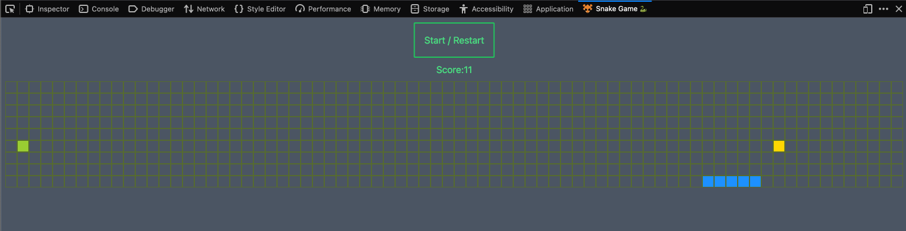

# Snake game in Firefox devtools panel 🦊🔬🐍

Play snake game in devtools panel

The game is based on [kubowania/Nokia3310-Snake](https://github.com/kubowania/Nokia3310-Snake) but has other features and modifications:

- Add pineapples to speed 50% up of the snake 🍍
- Re-generate map tiles based on screen size (offsetWidth) 🗺
- Integrate game into Firefox extension (devtools panel) 🦊
- Use TailwindCSS

screenshot:




## Usage
### install dependencies
```
npm i
```

### dev

dev and preview in Firefox browser
```
npm run dev
```
or
```
npx web-ext -s ./src run
```

dev with TailwindCSS
```
npm run dev:css
```

# Ref

* [kubowania/Nokia3310-Snake: A vanilla JavaScript game with tutorial](https://github.com/kubowania/Nokia3310-Snake "kubowania/Nokia3310-Snake: A vanilla JavaScript game with tutorial")
* [webextensions-examples/devtools-panels at master · mdn/webextensions-examples](https://github.com/mdn/webextensions-examples/tree/master/devtools-panels "webextensions-examples/devtools-panels at master · mdn/webextensions-examples")
* [Porting a Google Chrome extension | Firefox Extension Workshop](https://extensionworkshop.com/documentation/develop/porting-a-google-chrome-extension/ "Porting a Google Chrome extension | Firefox Extension Workshop")
* [chrome.devtools.panels - Chrome Developers](https://developer.chrome.com/docs/extensions/reference/devtools_panels/ "chrome.devtools.panels - Chrome Developers")
* [JavaScript APIs - Mozilla | MDN](https://developer.mozilla.org/en-US/docs/Mozilla/Add-ons/WebExtensions/API "JavaScript APIs - Mozilla | MDN")
